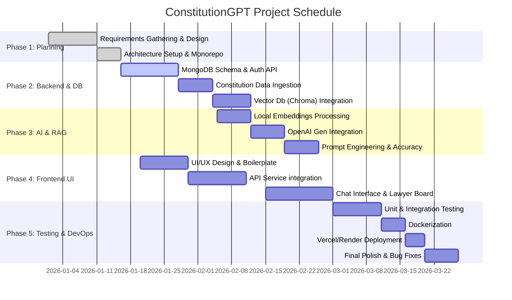

# IMPLEMENTATION

This chapter outlines the practical realization of the ConstitutionGPT project. It details the systematic application of chosen technologies across various layers of the architecture and defines the timeline over which these modules were developed and integrated.

## 5.1 Technologies used for Implementation

The implementation of the ConstitutionGPT platform relied upon a modern, scalable, and robust technology stack designed to seamlessly integrate natural language processing, real-time communications, and secure data management.

### 5.1.1 Frontend Layer (Client-Side)
The user interface is engineered to provide a highly responsive, interactive, and accessible experience across various devices.
* **React.js (v18)**: Serves as the core library for building dynamic, component-based user interfaces. It enables efficient state management and DOM manipulation.
* **Vite**: Utilized as the build tool and development server, offering significantly faster hot module replacement (HMR) and optimized production builds compared to traditional bundlers.
* **Bootstrap 5 & Custom CSS**: Employed for layout structuring and responsive design, ensuring cross-platform aesthetic consistency.
* **React Router**: Implemented for single-page application (SPA) client-side routing, enabling seamless transitions between chat interfaces, lawyer directories, and user profiles.

### 5.1.2 Backend Layer (Server-Side)
The backend architecture is built to handle heavy computational loads, asynchronous operations, and rapid API delivery.
* **Python 3**: The primary programming language used for backend development due to its extensive ecosystem in AI and data processing.
* **FastAPI**: A high-performance web framework for Python, used to develop the RESTful API endpoints. It natively supports asynchronous programming (`asyncio`) and automatic API documentation.
* **JWT (JSON Web Tokens)**: Used for secure, stateless user authentication and role-based access control (differentiating standard users from verified lawyers).

### 5.1.3 Database & Storage layer
The system relies on a hybrid database approach to manage both structured operational data and high-dimensional vector embeddings.
* **MongoDB**: A NoSQL database used as the primary data store for user profiles, chat histories, appointment bookings, and platform metadata. Selected for its schema flexibility and horizontal scalability.
* **ChromaDB**: An open-source vector database specifically designed for AI applications. It stores the semantic embeddings of the constitutional document chunks, enabling rapid nearest-neighbor similarity searches for the RAG pipeline.

### 5.1.4 Intelligence & NLP Layer
The core AI capabilities are powered by state-of-the-art machine learning models.
* **OpenAI API (GPT-4o-mini)**: Serves as the primary large language model (LLM) for generating conversational responses based on the provided context retrieved from the constitution documents.
* **Sentence Transformers (all-MiniLM-L6-v2)**: A lightweight, open-source embedding model used locally to convert constitutional text chunks and user queries into dense vector representations.

### 5.1.5 Implementation Methodology
The development was executed through a modular approach:
1. **Monorepo Architecture Setup**: Established separate `/frontend` and `/backend` directories for unified version control alongside independent dependency management.
2. **RAG Pipeline Integration**: The Indian Constitution text was chunked, vectorized using Sentence Transformers locally, and securely stored in ChromaDB. Queries are contextually augmented against ChromaDB before processing via OpenAI's GPT-4o-mini interface.
3. **UI Integration & Real-time Features**: Connected the React frontend to the backend using extensive API services, bringing key modules like the Lawyer Marketplace, real-time messaging, and AI Chat online.
4. **DevOps & Containerization**: The vector databases and API dependencies were containerized using Docker, allowing robust deployment schemes on Render (backend) and Vercel (frontend).

## 5.2 Project Scheduling (using GANTT charts)

The project was executed iteratively over an estimated timeline, mapping critical objectives across multiple agile development sprints. The scheduling, outlining the phases from initial planning to final deployment, is visually represented below using a Gantt chart.

